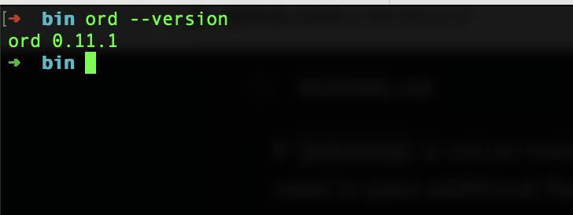

# Rune Alpha Ord

Rune Alpha Ord is an experimental index, block explorer, and command-line wallet. It is a forked version of the official Ord release, [Release 0.11.1](https://github.com/0xmodule/ord/commit/19db94a8de00885fd5043ef8c7a5021865843a46). This software comes with no warranty. Please refer to the [LICENSE](LICENSE) for more details.

## Overview

Rune Alpha Ord introduces ordinal theory to imbue satoshis with numismatic value, transforming them into collectible and tradable curios. This edition focuses on the Fungible Token architecture proposed for Bitcoin, known as Rune.

For a detailed understanding of the changes we've made compared to version 0.11.1, please refer to this [comparison](https://github.com/ordinals/ord/compare/master...0xmodule:ord:master).

## Documentation

Comprehensive documentation and guides are available at [the docs](https://docs.ordinals.com).

## Community

Join our [Discord server](https://discord.gg/jncetgZScu) to stay updated and engage in discussions about Rune Alpha.

## CHANGED

We've customized the Signature of Rune-related transactions to use `R` instead of `RUNE_TEST`. Transactions start syncing from [block 10](https://mempool.space/testnet/block/00000000700e92a916b46b8b91a14d1303d5d91ef0b09eecc3151fb958fd9a2e) for Testnet and [genesis block (block 0)](https://mempool.space/block/000000000019d6689c085ae165831e934ff763ae46a2a6c172b3f1b60a8ce26f) for mainnet.

You can try it out here:

- Testnet: https://testnet-scan.runealpha.xyz/
- Mainnet: https://runealpha.xyz/

## Installation
Rune Alpha running on version 0.11.1 of ord, so make sure you have correct version
You can install the latest pre-built binary from the command line with:
```
curl --proto '=https' --tlsv1.2 -fsLS https://ordinals.com/install.sh | bash -s
```

Or can find pre-built in this [page](https://github.com/ordinals/ord/releases/tag/0.11.1)

To check ord version:
```
ord --version
```
The version should be 0.11.1


## Syncing

`ord` requires a synced `bitcoind` node with `-txindex` to build the index of satoshi locations. `ord` communicates with `bitcoind` via RPC.

If `bitcoind` is run locally by the same user, without additional configuration, `ord` should find it automatically by reading the `.cookie` file from `bitcoind`'s datadir, and connecting using the default RPC port.

If `bitcoind` is not on mainnet, is not run by the same user, has a non-default datadir, or a non-default port, you'll need to pass additional flags to `ord`. See ord `--help` for details.

### Installing Bitcoin Core
Bitcoin Core is available from [bitcoincore.org](https://bitcoincore.org/) on the [download page.](https://bitcoincore.org/en/download/)

Making inscriptions requires Bitcoin Core 24 or newer.

This guide does not cover installing Bitcoin Core in detail. Once Bitcoin Core is installed, you should be able to run `bitcoind -version` successfully from the command line. Do NOT use `bitcoin-qt`.

For more detail please visit [here](https://docs.ordinals.com/guides/inscriptions.html)

### Get and Parse Data
`ord` makes RPC calls to `bitcoind`, which usually requires a username and password.

Using environment variables:
```
export ORD_BITCOIN_RPC_USER=bicoin
export ORD_BITCOIN_RPC_PASS=nakamoto
```

Everything almost done, now see the magic, your local ready to sync all Rune transaction:
```
ord --bitcoin-rpc-user ORD_BITCOIN_RPC_USER --bitcoin-rpc-pass ORD_BITCOIN_RPC_PASS --bitcoin-data-dir /root/.bitcoin-testnet/testnet3 --chain testnet  --index-runes-pre-alpha-i-agree-to-get-rekt --data-dir /root/.local/share/ord-rune-testnet server --enable-json-api --http-port 5656
```

Adding type `--index-runes-pre-alpha-i-agree-to-get-rekt` so that `ord` knows to sync all transactions related to runes 